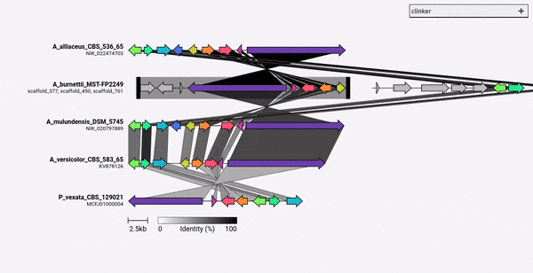

# clinker
Gene cluster comparison figure generator

## What is it?
clinker is a pipeline for easily generating publication-quality gene cluster
comparison figures.


Given a set of GenBank files, clinker will automatically extract protein translations,
perform global alignments between sequences in each cluster, determine the
optimal display order based on cluster similarity, and generate an interactive
visualisation (using [clustermap.js](https://github.com/gamcil/clustermap.js))
that can be extensively tweaked before being exported as an SVG file.

### A note on scope:
clinker was designed primarily as a simple way to visualise groups of homologous
biosynthetic gene clusters, which are typically small genomic regions with not many genes
(as in the example GIF). It performs pairwise alignments of all genes in all input files using
the aligner built into BioPython, then generates an interactive SVG document in the browser.
The alignment stage will scale very poorly to multiple genomes with many genes, and the resulting
visualisation will also be very slow given how many SVG elements it will contain.
If you are looking to align entire genomes, you will likely be better served using 
tools built for that purpose (e.g. [Cactus](https://github.com/ComparativeGenomicsToolkit/cactus)).



## Installation
clinker can be installed directly through pip:

`pip install clinker`

By cloning the source code from GitHub:

```
git clone https://github.com/gamcil/clinker.git
cd clinker
pip install .
```

Or, through conda:

```
conda create -n clinker -c conda-forge -c bioconda clinker-py
conda activate clinker
```

## Citation
If you found clinker useful, please cite:
```
clinker & clustermap.js: Automatic generation of gene cluster comparison figures.
Gilchrist, C.L.M., Chooi, Y.-H., 2020.
Bioinformatics. doi: https://doi.org/10.1093/bioinformatics/btab007
```

## Usage
Running clinker can be as simple as:

`clinker clusters/*.gbk`

This will read in all GenBank files inside the folder, align them, and print
the alignments to the terminal. To generate the visualisation, use the `-p/--plot`
argument: 

`clinker clusters/*.gbk -p <optional: file name to save static HTML>`

See `-h/--help` for more information:

```
usage: clinker [-h] [--version] [-r RANGES [RANGES ...]] [-gf GENE_FUNCTIONS] [-na] [-i IDENTITY] [-j JOBS] [-s SESSION] [-ji JSON_INDENT] [-f] [-o OUTPUT] [-p [PLOT]] [-dl DELIMITER] [-dc DECIMALS] [-hl] [-ha] [-mo MATRIX_OUT] [-ufo] [files ...]

clinker: Automatic creation of publication-ready gene cluster comparison figures.

clinker generates gene cluster comparison figures from GenBank files. It performs pairwise local or global alignments between every sequence in every unique pair of clusters and generates interactive, to-scale comparison figures using the clustermap.js library.

optional arguments:
  -h, --help            show this help message and exit
  --version             show program's version number and exit

Input options:
  files                 Gene cluster GenBank files
  -r RANGES [RANGES ...], --ranges RANGES [RANGES ...]
                        Scaffold extraction ranges. If a range is specified, only features within the range will be extracted from the scaffold. Ranges should be formatted like: scaffold:start-end (e.g. scaffold_1:15000-40000)
  -gf GENE_FUNCTIONS, --gene_functions GENE_FUNCTIONS
                        2-column CSV file containing gene functions, used to build gene groups from same function instead of sequence similarity (e.g. GENE_001,PKS-NRPS).

Alignment options:
  -na, --no_align       Do not align clusters
  -i IDENTITY, --identity IDENTITY
                        Minimum alignment sequence identity [default: 0.3]
  -j JOBS, --jobs JOBS  Number of alignments to run in parallel (0 to use the number of CPUs) [default: 0]

Output options:
  -s SESSION, --session SESSION
                        Path to clinker session
  -ji JSON_INDENT, --json_indent JSON_INDENT
                        Number of spaces to indent JSON [default: none]
  -f, --force           Overwrite previous output file
  -o OUTPUT, --output OUTPUT
                        Save alignments to file
  -p [PLOT], --plot [PLOT]
                        Plot cluster alignments using clustermap.js. If a path is given, clinker will generate a portable HTML file at that path. Otherwise, the plot will be served dynamically using Python's HTTP server.
  -dl DELIMITER, --delimiter DELIMITER
                        Character to delimit output by [default: human readable]
  -dc DECIMALS, --decimals DECIMALS
                        Number of decimal places in output [default: 2]
  -hl, --hide_link_headers
                        Hide alignment column headers
  -ha, --hide_aln_headers
                        Hide alignment cluster name headers
  -mo MATRIX_OUT, --matrix_out MATRIX_OUT
                        Save cluster similarity matrix to file

Visualisation options:
  -ufo, --use_file_order
                        Display clusters in order of input files

Example usage
-------------
Align clusters, plot results and print scores to screen:
  $ clinker files/*.gbk

Only save gene-gene links when identity is over 50%:
  $ clinker files/*.gbk -i 0.5

Save an alignment session for later:
  $ clinker files/*.gbk -s session.json

Save alignments to file, in comma-delimited format, with 4 decimal places:
  $ clinker files/*.gbk -o alignments.csv -dl "," -dc 4

Generate visualisation:
  $ clinker files/*.gbk -p

Save visualisation as a static HTML document:
  $ clinker files/*.gbk -p plot.html

Cameron Gilchrist, 2020
```
